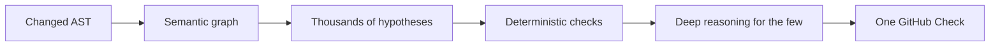

<h1 align="center">Mutation</h1>

<p align="center">
  <b>Agents change your code. Mutation makes it trustworthy.</b><br>
  Assurance for AI agents. Observe. Validate. Evolve.
</p>

<p align="center">
  <a href="https://mutation.sh">Website</a> ·
  <a href="https://mutation.sh/repositories">Explore repositories</a> ·
  <a href="https://mutation.sh/#how-it-works">How it works</a> ·
  <a href="https://mutation.sh/#join">Join the waitlist</a>
</p>

---

Your agents open PRs faster than anyone can read them. Mutation checks what changed **before you merge**. It is not another model reading the diff: it is a model of your program that knows what was true before each agent change, and returns one quiet GitHub Check instead of a wall of comments.

Works next to the agents you already use: **Cursor, Claude Code, Codex, Copilot**. Nothing to install in each tool.

## What a check tells you

| | |
|---|---|
| **What changed in behaviour** | A semantic diff: which execution paths, invariants and contracts moved, not which lines. |
| **How far it reaches** | Impact radius across public APIs, downstream symbols, data boundaries and the tests that cover them. |
| **What needs a human** | Thousands of checks run quietly. A finding reaches your review only when confidence is high. |

```text
Semantic review · acme/payments #412 (example output)

  ✓ 1,842 checks passed
  ! 2 behavioural changes
  ! 1 missing test path

  Before  authenticate() always runs before payment()
  After   one execution path reaches payment() without authenticate()

  Impact radius: High
  Public APIs affected 3 · Downstream symbols 17 · Database boundaries 2
```

## How it works



1. **Observe.** See which behaviours, paths and contracts an agent actually moved, so review starts with the risk, not the noise.
2. **Validate.** Each change becomes thousands of small checks. Most settle deterministically; only the suspicious few need a large model.
3. **Evolve.** Patterns that keep holding become explicit invariants. Reviewers promote them once; Mutation enforces them on every agent commit after.

Evidence climbs a ladder of trust, and gets stricter only where the code deserves it:

`Heuristic` → `Statistical` → `Semantic` → `Explicit invariant` → `Symbolic verification` → `Formal proof`

## Proof on your own history

Shadow mode is read-only and changes no workflows. Mutation is built to replay past commits using only what was known at the time, then check which later fixes, reverts and incidents it could have flagged before merge.

## Who it is for

**For:** engineering leads and senior reviewers who own defect investigation; teams where agents open most of the PRs; SaaS backends where a bad merge costs an incident, not a nit.

**Not for:** teams that barely use coding agents; anyone looking for another AI that comments on the diff.

## Status

We are building the first release. Open a [public repository preview](https://mutation.sh/repositories) to see the approach, or [join the waitlist](https://mutation.sh/#join) and we will email you when checks open for your repositories.

---

<p align="center">
  <a href="https://mutation.sh/content/security">Security</a> ·
  <a href="https://mutation.sh/content/careers">Careers</a> ·
  <a href="https://mutation.sh/content/privacy">Privacy</a> ·
  <a href="https://mutation.sh/content/terms">Terms</a> ·
  <a href="mailto:support@mutation.sh">support@mutation.sh</a>
</p>
